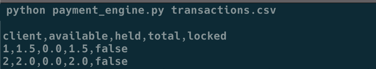

<!-- TABLE OF CONTENTS -->
<details open="open">
  <summary>Table of Contents</summary>
  <ol>
    <li>
      <a href="#about-the-project">About The Project</a>
      <ul>
        <li><a href="#built-with">Built With</a></li>
      </ul>
    </li>
    <li>
      <a href="#getting-started">Getting Started</a>
      <ul>
        <li><a href="#prerequisites">Prerequisites</a></li>
        <li><a href="#installation">Installation</a></li>
      </ul>
    </li>
    <li><a href="#usage">Usage</a></li>
  </ol>
</details>


<!-- ABOUT THE PROJECT -->
## Payment Engine 



The following is a Dummy payments engine that reads a series of transactions from a CSV, updates client accounts,
handles disputes and chargebacks, and then outputs the state of clients accounts as a CSV.

### Built With

* [Python3](https://www.python.org)


<!-- GETTING STARTED -->
## Getting Started

### Prerequisites

You will need Python3 in order to run this script.

1. Visit https://www.python.org and download the latest version for your OS.
2. Make sure Python and pip are accessible via command line.

### Installation

1. Clone the repo
   ```sh
   git clone https://github.com/L271828R/payment_engine 
   ```
2. CD into payment_engine 
   ```sh
   cd payment_engine 
   ```
3. create a python virtual environment 
   ```sh
   python -m venv env
   ```
4. activate your virtual environment
   ```sh
   source env/bin/activate 
   ```
5. install dependencies via pip
   ```sh
   pip install -r requirements.txt
   ```
<!-- USAGE EXAMPLES -->
## Usage

Use this space to show useful examples of how a project can be used. Additional screenshots, code examples and demos work well in this space. You may also link to more resources.

_For more examples, please refer to the [Documentation](https://example.com)_


<!-- ROADMAP -->
## Roadmap

See the [open issues](https://github.com/othneildrew/Best-README-Template/issues) for a list of proposed features (and known issues).

